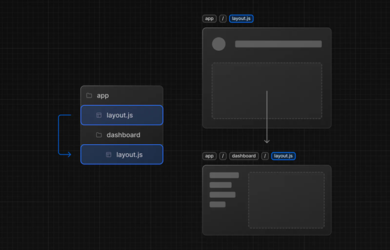

# Routing

All in this page was get from [Next.JS Routing Tutorial](https://nextjs.org/docs/app/building-your-application/routing).

## Introduction

- Folders are used to define routes
- Route is a single path of the nested folders, following the file-system hierarchy from **Root Folder** down to a final **Leaf Folder**

### Routing Segment

- Each folder in a Route represents a route segment.
- Each router segment is mapped to a corresponding segment in a URL path

> **URL Path:**
>
> `acme.com/dashboard/settings`
>
> **Folder Hierarchy:**
>
> | acme.com (Root Segment)
>
> |&emsp;|&emsp;dashboard (Segment)
>
> |&emsp;|&emsp;|&emsp;settings (Leaf Segment)

### Nested Routes

To create a nested route: Nest folders inside each other

### File Convention

| File  | Definition |
| layout | Shared UI for a segment and its children |
| page | Unique UI of a route and make routes publicly accessible |
| loading | Loading UI for a segment and its children |
| not-found | Not found UI for a segment and its children |
| error | Error UI for a segment and its children |
| global-error | Global Error UI |
| route | Server-side API endpoint |
| template | Specialized re-rendered Layout UI |
| default | Fallback UI for Parallel Routes |

### Component Hierarchy

The React components defined in special files of a route segment are rendered in a specific hierarchy:

1. layout.js
1. template.js
1. error.js (React error boundary)
1. loading.js (React suspense boundary)
1. not-found.js (React error boundary)
1. page.js or nested layout.js

```javaScript
<Layout>
  <Template>
    <ErrorBoundary fallback={<Error />}>
      <Suspense fallback={<Loading />}>
        <ErrorBoundary fallback={<NotFound />}>
          <Page />
        <ErrorBoundary />
      <Suspense />
    <ErrorBoundary />
  <Template />
<Layout />
```

In a nested route, the components of a segment will be **nested** inside the components of is **parent segment**.

### Advanced Routing Patterns

- **Parallel Routes:** Allow you to simultaneously show two or more pages in the same view that can be navigated independently. You can use them for split views that have their own sub-navigation. E.g. Dashboards.
- **Intercepting Routes:** Allow you to intercept a route and show it in the context of another route. You can use these when keeping the context for the current page is important. E.g. Seeing all tasks while editing one task or expanding a photo in a feed.

## Defining Rutes

- `page.js` file is used to make route segments publicly accessible. If a folder does **not** have a `page.js` file, them it will **not** be publicly accessible.
  - Folders that are not routing pages should not hate the `page.js` file.
  - `.js`, `.jsx` and `.tsx` are valid extensions for page file.

### Creating UI

Read the original Next.JS Doc [here](https://nextjs.org/docs/app/building-your-application/routing/pages-and-layouts).

#### Page

UI that is **unique** to a route.

**Structure:**

  ```javascript
  export default function Page() {
    return <> Your code Here</>;
  }
  ```

**Good to know:**

- A page is always the leaf of the route subtree.
- .js, .jsx, or .tsx file extensions can be used for Pages.
- A page.js file is required to make a route segment publicly accessible.
- Pages are Server Components by default but can be set to a Client Component. To build a Client Component add `'use client'` in the file.
- Pages can fetch data. View the Data Fetching section for more information.
- Read more about Pages [here](https://nextjs.org/docs/app/building-your-application/routing/pages-and-layouts#pages).

#### Layouts

UI that is **shared** across multiple rotes.

**Structure:**

```javascript
export default function PageLayout({children}:{children.ReactNode}) {
  return (
    <section>
      {/* Include shared UI here e.g. a header or sidebar */}
      {children} /* will be a page or nested layout */
    <section />
  )
}
```

**Good to know:**

- On navigation, layouts preserve state, remain interactive, and do not re-render. Layouts can also be nested.
- You can define a layout by default exporting a React component from a layout.js file. The component should accept a children prop that will be populated with a child layout (if it exists) or a child page during rendering.
- Read more about Layout [here](https://nextjs.org/docs/app/building-your-application/routing/pages-and-layouts#layouts).

##### RootLayout

It is required, and should be defined at the top level of the `app` directory and applies to all routes. This layout enables you to modify the initial HTML returned from the server. More info [here](https://nextjs.org/docs/app/building-your-application/routing/pages-and-layouts#root-layout-required).

**Structure:**

```javascript
export default function RootLayout({ children }: { children: React.ReactNode }) {
  return (
    <html lang="en">
      <body>{children}</body>
    </html>
  )
}
```

##### Nesting Layout

Layouts defined inside a folder (e.g. app/dashboard/layout.js) apply to specific route segments (e.g. acme.com/dashboard) and render when those segments are active. By default, layouts in the file hierarchy are nested, which means they wrap child layouts via their children prop. More info [here](https://nextjs.org/docs/app/building-your-application/routing/pages-and-layouts#nesting-layouts).

**Structure:**

```javascript
export default function DashboardLayout({ children }: { children: React.ReactNode }) {
  return <section>{children}</section>
}
```

**Good to know:**

- Only the root layout can contain `<html>` and `<body>` tags.

##### Combining Layouts

If you combine RootLayout with nesting layout, the root layout would wrap the nesting layout.



You can use Route Groups to opt specific route segments in and out of shared layouts.

#### Template

Templates are similar to layouts in that they wrap each child layout or page. Unlike layouts that persist across routes and maintain state, templates create a new instance for each of their children on navigation. This means that when a user navigates between routes that share a template, a new instance of the component is mounted, DOM elements are recreated, state is not preserved, and effects are re-synchronized.

There may be cases where you need those specific behaviors, and templates would be a more suitable option than layouts. For example:

- Features that rely on `useEffect` (e.g logging page views) and `useState` (e.g a per-page feedback form).
- To change the default framework behavior.

A template can be defined by exporting a default React component from a `template.js` file. The component should accept a `children` prop.

More info in [Next.JS Template](https://nextjs.org/docs/app/building-your-application/routing/pages-and-layouts#templates).

**Structure:**

```javascript
export default function Template({ children }: { children: React.ReactNode }) {
  return <div>{children}</div>
}
```

In terms of nesting, template.js is rendered between a layout and its children. Here's a simplified output:

```javascript
<Layout>
  {/* Note that the template is given a unique key. */}
  <Template key={routeParam}>{children}</Template>
</Layout>
```

### Linking and Navigating

There are 3 ways to navigate between routes in Next.JS:

1. [Link Component](#link-component)
2. [useRouter Hook](#userouter-hook)
3. [History API](#history-api)

#### Link Component

`<Link>` is a built-in component that extends the HTML `<a>` tag to provide prefetching and client-side navigation between routes. It is the **primary** and **recommended** way to navigate between routes in Next.js.

You can use it by importing it from next/link, and passing a href prop to the component:

**How to use:**

```javascript
import Link from 'next/link'
 
export default function Page() {
  return <Link href="/dashboard">Dashboard</Link>
}
```

**More info:**

- [Examples](https://nextjs.org/docs/app/building-your-application/routing/linking-and-navigating#examples).
- [Link API reference](https://nextjs.org/docs/app/api-reference/components/link) for more.
- [Scrolling to an id](https://nextjs.org/docs/app/building-your-application/routing/linking-and-navigating#scrolling-to-an-id).
- [Disabling scroll restoration](https://nextjs.org/docs/app/building-your-application/routing/linking-and-navigating#disabling-scroll-restoration)

#### useRouter Hook

The `useRouter` hook allows you to programmatically change routes from **Client Components**. For Server Components, you would `redirect()` instead.

Example:

```javascript
'use client'
 
import { useRouter } from 'next/navigation'
 
export default function Page() {
  const router = useRouter()
 
  return (
    <button type="button" onClick={() => router.push('/dashboard')}>
      Dashboard
    </button>
  )
}
```

> **Recommendation:** Use the `<Link>` component to navigate between routes unless you have a specific requirement for using useRouter.

**More Info:**

- [API reference](https://nextjs.org/docs/app/api-reference/functions/use-router).

#### History API

Next.js allows you to use the native `window.history.pushState` and `window.history.replaceState` methods to update the browser's history stack without reloading the page. `pushState` and `replaceState` calls integrate into the Next.js Router, allowing you to sync with usePathname and useSearchParams.

1. `window.history.pushState`: Use it to add a new entry to the browser's history stack. The user can navigate back to the previous state. [Exemple](https://nextjs.org/docs/app/building-your-application/routing/linking-and-navigating#windowhistorypushstate).
2. `window.history.replaceState`: Use it to replace the current entry on the browser's history stack. The user is not able to navigate back to the previous state. [Example](https://nextjs.org/docs/app/building-your-application/routing/linking-and-navigating#windowhistoryreplacestate).

### How Routing and Navigation works

See [How Routing and Navigation works](https://nextjs.org/docs/app/building-your-application/routing/linking-and-navigating#how-routing-and-navigation-works) for more info.

When the user navigates to a new route, only the route segments that change re-render. App Router uses a hybrid approach:

- Server: application code is automatically [code-split](#code-splitting) by route segments.
- Client: Next.JS [prefetches](#prefetching) and [caches](#catching) the rout segment.

#### Routing and Navigation Concepts

See bellow a shallow explanation about Routing and Navigation concepts:

- [Code Splitting](#code-splitting)
- [Prefetching](#prefetching)
- [Catching](#catching)
- [Partial Rendering](#partial-rendering)
- [Soft Navigation](#soft-navigation)
- [Back and Forward Navigation](#back-and-forward-navigation)
- [Routing between pages/ and app/](#routing-between-pages-and-app)

##### Code Splitting

See [Next.JS Code Splitting](https://nextjs.org/docs/app/building-your-application/routing/linking-and-navigating#1-code-splitting).

Allows to split the application code into smaller bundles to be downloaded and executed. This means only the code needed for the current route is loaded on navigation.

##### Prefetching

Prefetching is a way to preload a route in background before the user visit it. There are two ways to prefetch a route in Next.JS:

- Using `<Link>` Component
  - Static Route: prefetch defaults to `true`. The entire route is prefetched and cached.
  - Dynamic Route: prefetch defaults to `automatic`. Only the shared layout, down the rendered "tree" of components until the first loading.js file, is prefetched and cached for 30s.
  - See [Link API reference](https://nextjs.org/docs/app/api-reference/components/link) for more information.
- Using `router.prefetch()`
  - The `useRouter` hook can be used to prefetch routes programmatically.

**Good to Know:**

- You can disable prefetching by setting the prefetch prop to false.
- Prefetching is not enabled in development, only in production.

See [Next.JS Prefetching](https://nextjs.org/docs/app/building-your-application/routing/linking-and-navigating#2-prefetching) for more information.

##### Catching

The React Server Component Payload of prefetched route segments and visited routes are stored in the **Router Cache** (in-memory client-side cache).

This cache is used as much as possible, instead of making a new request to the server.

- See [Next.JS Caching](https://nextjs.org/docs/app/building-your-application/routing/linking-and-navigating#3-caching) for more information.
- Learn about Router Cache [here](https://nextjs.org/docs/app/building-your-application/data-fetching/fetching-caching-and-revalidating#caching-data).

##### Partial Rendering

Partial rendering means only the route segments that change on navigation re-render on the client, and any shared segments are preserved. See [Next.JS Partial Rendering](https://nextjs.org/docs/app/building-your-application/routing/linking-and-navigating#4-partial-rendering) for more info.

Without partial rendering, each navigation would cause the full page to re-render on the client.

##### Soft Navigation

Browsers perform a "hard navigation" when navigating between pages. The Next.js App Router enables "soft navigation" between pages, ensuring only the route segments that have changed are re-rendered (partial rendering). This enables client React state to be preserved during navigation.

##### Back and Forward Navigation

By default, Next.js will maintain the scroll position for backwards and forwards navigation, and re-use route segments in the [Router Cache](https://nextjs.org/docs/app/building-your-application/data-fetching/fetching-caching-and-revalidating#caching-data).

##### Routing between pages/ and app/

When incrementally migrating from `pages/` to `app/` the Next.JS router will automatically handle **hard navigation** between the two. If you prefere to dizable this handle completely and manage the routing manually, you can set `experimental.clientRouterFilter` to `false` in `next.config.js`. When this feature is disabled, any dynamic routes in pages that overlap with app routes won't be navigated to properly by default.

See [Next.JS Routing between pages/ and app/](https://nextjs.org/docs/app/building-your-application/routing/linking-and-navigating#7-routing-between-pages-and-app) for more information.
